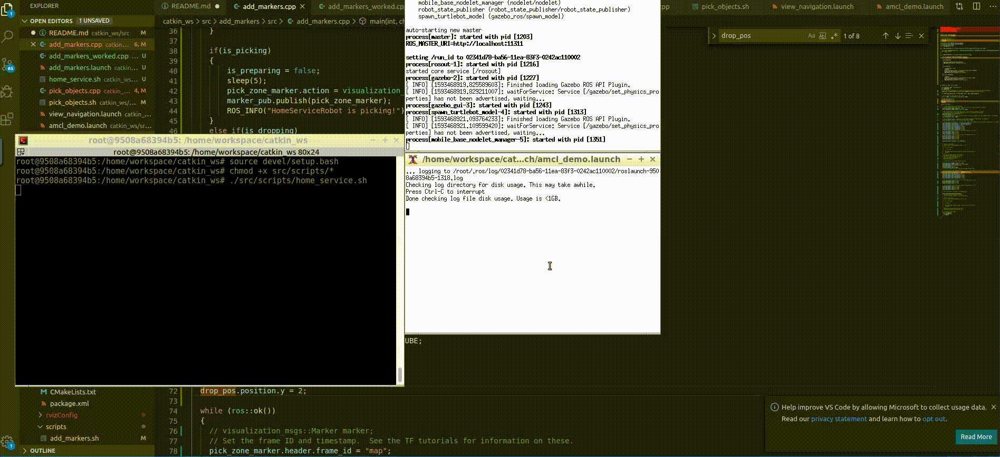

# Home Service Robots

## Usage

### Step 1: Update the workspace
```
sudo apt-get update && apt-get upgrade
sudo apt-get install ros-kinetic-navigation
```

### Step 2
- clone the project to your local space
- run
    ```
    catkin_make
    source devel/setup.bash
    chmod +x ./src/scripts/*
    ./src/scripts/home_service.sh
    ```

### Simulations
